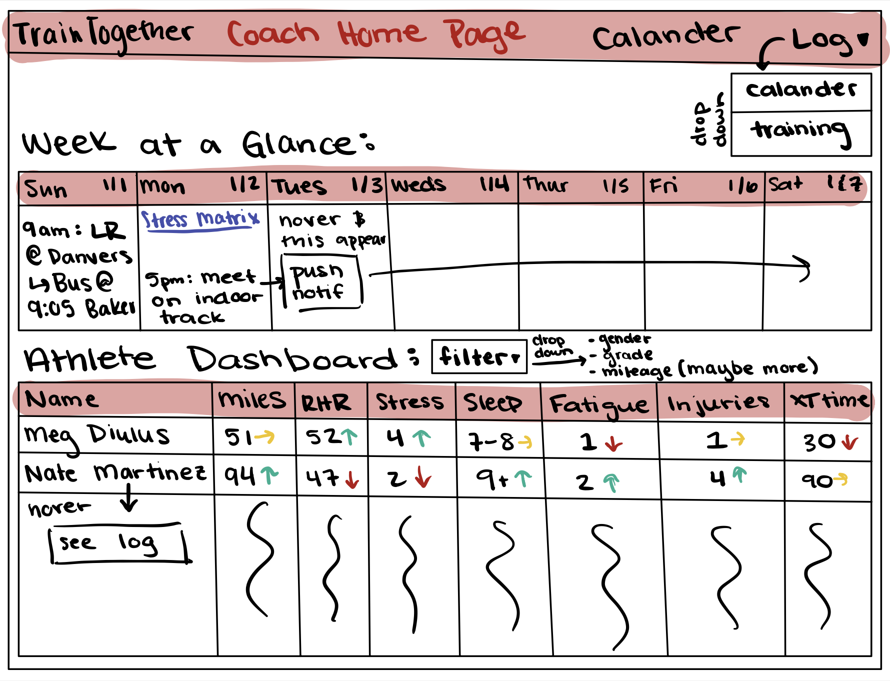
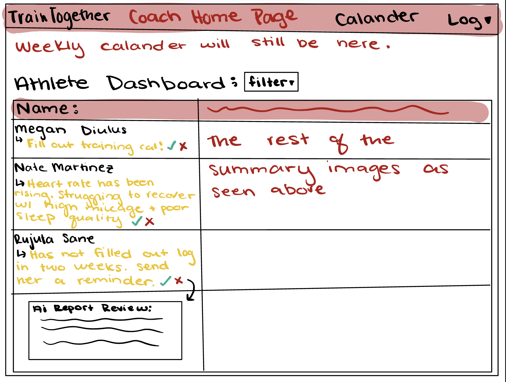

# Assignment 3
Megan Diulus (kerb: mediulus)

## Augment the design of a concept. 

### Original Concept

        concept TrainingRecords:
            purpose: Record coach plans (date, percentage, notes) and athlete daily data in one place, and provide simple week-over-week summaries for the dashboard.
            principle: After a coach sets a daily plan for an athlete and the athlete logs that day’s data, the system can compute weekly totals/averages and trend arrows (up/down/flat).

            state:
                a set of DailyRecords with:
                    a date Date
                    an athlete User
                    coachRecommendations {CoachFields}
                    athleteData JSONField

                a set of CoachFields with:
                    a percentage Number
                    a note String
                
            actions:
                createRecord(coach: User, athlete: User, date: Date, percentage?: Number, note?: String): (record: DailyRecord)
                    requires: coach exists and role = coach; athlete exists and role = athlete; no existing DailyRecord for (athlete, date)
                    effects: creates a new DailyRecord with optional CoachFields

                updateCoachFields(coach: User, record: DailyRecord, percentage?: Number, note?: String): (record: DailyRecord)
                    requires: record exists; coach is the coach of the athlete’s team
                    effects: updates coachRecommendations for the record

                logAthleteData(athlete: User, record: DailyRecord, data: JSONField): (record: DailyRecord)
                    requires: record exists and belongs to athlete; OR no record exists yet for (athlete, date)
                    effects: if no record exists, creates a new DailyRecord with athleteData; otherwise updates athleteData

                updateAthleteData(athlete: User, record: DailyRecord, data: JSONField): (record: DailyRecord)
                    requires: record exists and belongs to athlete
                    effects: updates the athleteData JSON field

                deleteRecord(actor: User, record: DailyRecord)
                    requires: record exists; actor is either the athlete (for athleteData) or the coach of the team (for coachRecommendations)
                    effects: deletes the DailyRecord

                computeWeeklySummary(athlete: User, weekStart: Date): (summary: WeeklySummary)
                    requires: weekStart is the canonical start of a week
                    effects: calculates totals/averages for that week and trends compared to the prior week; does not change stored state

### AI Augmented Comment

        concept TrainingRecords:
            **NEW** purpose: Record coach plans and athlete data, compute week-over-week summaries, and—using AI— generate short, factual notes summarizing how an athlete appears to be responding to training. (All data originates from a Google Sheet import; the AI reads the derived weekly summaries.)

            **NEW** principle:  Maintain canonical daily records and derive weekly summaries that power the dashboard. Any automation (e.g., AI notes, reminders) reads from these summaries and produces separate, reviewable outputs; it never modifies training data.

            state:
                a set of DailyRecords with:
                    a date Date
                    an athlete User
                    coachRecommendations {CoachFields}
                    athleteData {AthleteData}
                    mileageRecommendation number
                    **NEW** aiRecommendation String

                a set of CoachFields with:
                    a percentage Number
                    a note String

                a set of AthleteData with
                    a mileage number
                    a stress number
                    a restingHeartRate number
                    an excerciseHeartRate number
                    a perceivedExertion number
                    a notes String

                a WeeklySummary (computed, not stored permanently) with:
                    an athlete User
                    a weekStart Date
                    a totalMileage Number
                    an averageStress Number
                    an averageSleep Number
                    an averageRestingHeartRate Number
                    an averageExerciseHeartRate Number
                    a trendDirection Enum{up, down, flat}
                    a previousWeekComparison {
                        mileageChange Number
                        stressChange Number
                        sleepChange Number
                    }?
        
                
            actions:
                actions (existing unchanged):
                    createRecord(coach: User, athlete: User, date: Date, percentage?: Number, note?: String): (record: DailyRecord)
                    updateCoachFields(coach: User, record: DailyRecord, percentage?: Number, note?: String): (record: DailyRecord)
                    logAthleteData(athlete: User, record: DailyRecord, data: AthleteData): (record: DailyRecord)
                    updateAthleteData(athlete: User, record: DailyRecord, data: AthleteData): (record: DailyRecord)
                    deleteRecord(actor: User, record: DailyRecord)
                    computeWeeklySummary(athlete: User, weekStart: Date): (summary: WeeklySummary)

                NEW action (LLM notes-only):
                    summarizeAndRecommend(athlete: User, weekStart: Date): { recommendation: String }
                        requires:
                            athlete exists
                            computeWeeklySummary(athlete, weekStart) is available
                        effects:
                            - Derives the WeeklySummary for (athlete, weekStart).
                            - Detects missing plan/log days via rule-based checks:
                                * missingCoachData = dates in the week without coachRecommendations
                                * missingAthleteData = dates in the week without athleteData
                            - Calls the LLM with a deterministic prompt to generate ONE short, factual note (<= 200 words)
                            summarizing observations for the week and flagging missing data. No medical advice.
                            - Validators (reject and return error if violated):
                                * length <= 200 words
                                * evidence-only (reference only fields present in WeeklySummary / per-day table)
                                * no medical/prescriptive language; no invented data; respectful tone
                            - On success: stores the same `aiRecommendation` string onto each DailyRecord belonging to
                            (athlete, weekStart..weekStart+6d) for convenient display, and returns { recommendation }.

            syncs:
            UpdateWeeklySummary
                when: WeeklyTick(weekStart, team)
                then: for each athlete on team:
                        computeWeeklySummary(athlete, weekStart)
                        summarizeAndRecommend(athlete, weekStart)

## Design the user interaction.

In these sketches you can see the AI implementation where an LLM summarizes the athletes trianing in a short note to help clarify trends and notify the coach if an athlete is negatively reacting to certain training stimuli. 

This feature is highly useful for two primary reasons. First, it keeps the coach accountable for filling out training logs regularly, while also notifying them if an athlete is not keeping up to date on their training log. Second, when the coach goes to check out his weekly dashbaord, they can see so far what the weekly trend is. However, they know nothing about what this trend is looking like over time an how an athlete is truly responding to training. The LLM is able to see the users training information and create inferences on how they are doing or if they may be having a tough week. Additionally, the coach may not agree with the LLMs response, or the LLM may have hallucinated, therefore the coach is able to review the LLM's response and it can learn and process this information to make better reviews in the future. 

## Implement your concept

[Implementation](./src/training-records.ts)

[Spec](./src/training-records.spec)

[Test suit](../project%20implementation/training-records-ai/src/training-records-tests.ts)

Run npm start to test

## Explore richer test cases and prompts.

**Test 1**
This test was designed to check whether the LLM would correctly identify a routine training cycle as non-concerning. The week included a single tempo workout and a series of easy runs and rest days, with stable heart rate, stress, and sleep metrics. The goal was for the model to reassure the coach that the athlete was responding normally. However, I ran into two issues: first, the model occasionally hallucinated data when metrics were missing, and second, it sometimes searched for problems where there were none, flagging expected workout strain as a concern. To address this, I added explicit rules in the prompt to limit what counts as “concerning,” but the LLM still sometimes highlighted normal hard sessions as red flags.

**Test 2**
This scenario was intended to verify that the LLM could identify a clear case of athlete fatigue when it was actually present. The athlete showed elevated resting and exercise heart rates on back-to-back non-hard days (Tuesday and Wednesday), combined with higher stress and reduced sleep, before trending back to normal later in the week. Ideally, the model should have flagged those two days as a concerning pattern. Instead, the LLM downplayed the issue and reported that the training looked stable overall. The problem here was that, even though I had added thresholds for what “concerning” means, the model still lacked a strict requirement to apply the rules only to non-hard days and to require consecutive-day alignment. Without that enforcement, it often failed to call out real fatigue patterns. 

**Test 3**
This case tested whether the LLM would handle incomplete logging properly. The week had several days where the coach wrote a plan but the athlete did not log data, or vice versa. The goal was for the model to note the missing data explicitly, avoid inventing values, and provide reassurance if the available days showed no concerning patterns. The LLM mostly did this well, listing the dates where information was missing and giving a neutral summary. However, it sometimes went beyond the instructions by adding weekly totals or averages that weren’t actually part of the logs. This showed that while the sufficiency rules improved gap handling, the model still tended to over-summarize when not tightly constrained.

For all of these test cases an issue that I ran into was when I fixed an issue with one test case, it broke the rest of them. I was able to set very clear values for concerning recomendations or amount of allowed data to fix this issue. 

## Add validators to your code.

**Invented Metrics or Paces**
Issue: The LLM might cite mileage, heart rate, stress, or pace values that were never in the logs.

Validator: Parse all numbers in the recommendation and compare against the weekDays values (mileage, stress, sleep, RHR, EHR, PE). If a number isn’t in the week data (and isn’t a year/date), throw an error.

**Out-of-Range Dates**
Issue: The LLM might reference dates outside the Monday–Sunday week under analysis.

Validator: Extract all YYYY-MM-DD strings from the response and ensure they fall between weekStartDate and weekStartDate + 6. If not, throw an error.

**Decision Consistency**
Issue: The LLM might declare “Insufficient data” when fewer than 3 logs are missing, or fail to declare it when 3+ are missing. Similarly, it might state a “concerning trend” without ≥2 consecutive non-hard days matching the rule.

Validator: Precompute missing counts from checkMissingCoachData and checkMissingAthleteData. If total missing ≥3, ensure the response contains the exact required text: “Insufficient data for meaningful analysis. Please ensure consistent daily logging of all metrics.” Otherwise, check that the response contains reassurance if no concerns were precomputed, or cites specific dates if concerns were found.